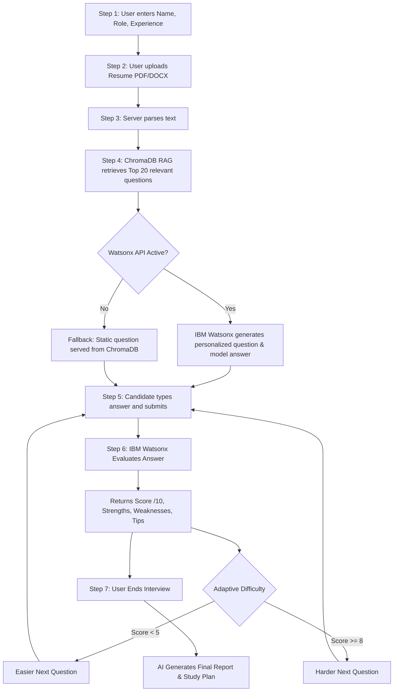

# 🤖 AI Interview Trainer (v2.0)


An intelligent, full-stack, AI-powered mock interviewer application. This project uses **IBM Watsonx (LLaMA 3.3 70B)** and a **ChromaDB RAG pipeline** to dynamically generate personalized technical interview questions, evaluate candidate answers in real time, and provide actionable feedback.

Developed as part of the **IBM Edunet Summer Internship Project**.

---

## ✨ Key Features

- 📄 **Resume Parsing:** Upload PDF or DOCX resumes; the AI extracts your background to hyper-personalize questions.
- 🎯 **RAG Pipeline Grounding:** ChromaDB retrieves semantically relevant, expert-curated interview questions to guide the LLM and eliminate hallucinations.
- 🎚️ **Adaptive Difficulty:** An SQLite-backed engine dynamically tracks your real-time score. Consistent high scores trigger harder questions; lower scores trigger fundamental questions.
- 🧠 **IBM Watsonx Evaluation:** Real-time grading (0-10) with strengths, weaknesses, actionable improvement tips, and a generated "Model Answer" for every question you attempt.
- 📊 **Historical Score Tracking:** Dedicated dashboard to view past sessions and track your interview performance over time.

---

## 🏗️ Architecture & Workflow

### User & System Workflow



---

## 🛠️ Technology Stack

| Layer | Technology | Purpose |
|---|---|---|
| **Frontend** | HTML5, CSS3, Vanilla JS | Responsive, glassmorphic UI with async REST API calls |
| **Backend** | Python, FastAPI | High-performance async REST API server |
| **AI / LLM** | IBM Watsonx (`meta-llama/llama-3-3-70b-instruct`) | Core inference engine for generation and evaluation |
| **Vector DB** | ChromaDB | Semantic retrieval of 500+ curated interview questions |
| **Session DB** | SQLite | Persistent storage of scores and session history |
| **Security** | SlowAPI, python-dotenv | Rate-limiting endpoints and hiding API credentials |

---

## 🚀 Installation & Local Setup

### Prerequisites
- Python 3.9+
- An IBM Cloud Account with Watsonx.ai access (au-syd or us-south region)

### 1. Clone the Repository
```bash
git clone https://github.com/Yashgupta-01/Interview-Trainer-Agent.git
cd Interview-Trainer-Agent
```

### 2. Environment Variables
Create a `.env` file in the root directory and add your IBM Cloud credentials:
```env
WATSONX_API_KEY=your_ibm_cloud_api_key_here
WATSONX_PROJECT_ID=your_watsonx_project_id_here
```
*(Never commit your `.env` file! It is ignored via `.gitignore`)*

### 3. Install Dependencies
```bash
python -m venv venv
venv\Scripts\activate  # Windows
# source venv/bin/activate  # Mac/Linux
pip install -r backend/requirements.txt
```

### 4. Run the Server
You can launch the backend simply by running the provided batch file (Windows):
```bash
.\start_backend.bat
```
Or manually via Uvicorn:
```bash
uvicorn backend.main:app --host 127.0.0.1 --port 8000 --reload
```

### 5. Access the App
Open your browser and navigate to: [http://127.0.0.1:8000](http://127.0.0.1:8000)

---

## 🛡️ Security Posture

This application incorporates several backend security measures designed to protect API quotas, prevent data leaks, and sanitize user input:
- **Credential Isolation:** All IAM tokens and API keys are stored securely in `.env` variables and NEVER exposed to the frontend.
- **DDoS / Spam Protection:** `SlowAPI` middleware implements strict token-bucket rate limiting on expensive AI endpoints (e.g., 5 requests/minute) to prevent API abuse and bill shock.
- **Prompt Injection Defense:** Strict JSON output requirements and conversational prefix strippers (Regex extraction) prevent the LLM from executing malicious prompt injections.
- **Local Data Storage:** Candidate resumes are parsed entirely in memory and session data is stored in a local SQLite database, meaning no PII is permanently stored in public cloud buckets.

---

##Note for the deployment:
During the deployment phase to cloud platforms (like Render/Vercel), I encountered consistent server crashes ("Out of Memory" - OOM errors) on the standard free tiers.

The Root Cause: Our application utilizes an advanced RAG (Retrieval-Augmented Generation) pipeline powered by ChromaDB. When the server starts, ChromaDB must download and load the all-MiniLM-L6-v2 sentence-transformer AI embedding model directly into the server's RAM to perform vector similarity searches.

Free-tier cloud environments strictly limit applications to 512 MB of RAM. The combination of the FastAPI backend, ChromaDB's C++ dependencies, and loading the ONNX AI embedding model inherently spikes memory usage beyond this 512 MB limit, causing the cloud provider to forcefully kill the container.

**It's ready to be deployed but needs a better service.


